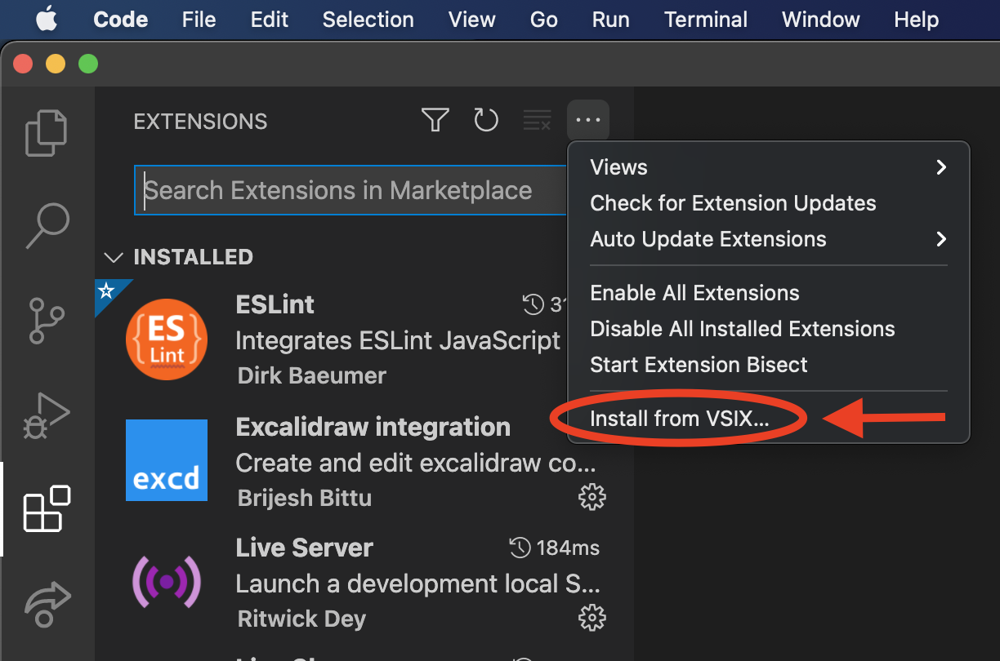

# A Tldraw Extension Build Using vscode-editor
Create your variant of the [Tldraw VS Code extension](https://marketplace.visualstudio.com/items?itemName=tldraw-org.tldraw-vscode).

### Installation / Development

 1. `git clone git@github.com:seflless/tldraw-vscode-editor.git`
 2. `cd tldraw-vscode-editor`
 3. `yarn start`
 4. Open a .tldr file from the `examples` folder
 5. Now start customizing `editor/src` files

### Sharing Your Extension/Editor

 1. Create an extension installer, you can share directly to people
   1. `yarn package`
   1. The installer will be created in the `out` folder
   1. People can then use the installer by going to the extension window and choosing `Install from VSIX...`
     - 
  1. Coming soon: automated publishing to the Marketplace. For now you can use the workflow where you upload the .vsix installer file